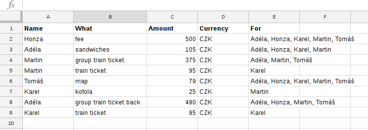
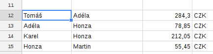

SplitBill
=========

Simple google sheets macro/python script determining how to settle all debts among n people using at most n-1 payments.

Example
-------

Imagine five friends who have taken part in a puzzle hunt. Honza paid the fee,
Adéla bought stuff to make sandwiches (for four of them, as Tomáš took his own
food), Martin bought group train ticket for himself, Adéla and Tomáš and
a separate one for Karel, who has a discount card. Tomáš got the map for the whole
team. Then in the pub at the finish line Karel paid for Martin's kofola, as he
couldn't find his wallet at the moment. Adéla bought the train ticket back for
four, Karel got his own. Now they are luckily back, relaxing and trying to
figure out how to make everyone get the money they should get in possibly the
easiest way.

Google Sheets solution
----------------------

Let's write all the expenses into a Google Sheet:



Now we need to add the macro. Go to Tools → Script editor → insert the content of `splitbill.js` and hit save.

Back to the sheet. Select some cell and insert `=splitbill(A2:E9)`. We get the payments instructions:



Python solution
---------------

Let's write all the expenses in `hunt.csv` file:

```
Name,What,Amount,Currency,For
Honza,fee,500,CZK,All
Adéla,sandwiches,105,CZK,AllBut Tomáš
Martin,group train ticket,375,CZK,Martin Adéla Tomáš
Martin,train ticket,95,CZK,Karel
Tomáš,map,79,CZK,All
Karel,kofola,25,CZK,Martin
Adéla,group train ticket back,490,CZK,AllBut Karel
Karel,train ticket back,95,CZK,Karel
```

Now let's run `splitbill.py` script with the above input:

```
$ python3 splitbill.py -p 'Adéla,Karel,Martin,Honza,Tomáš' -c CZK hunt.csv
```

The script outputs the transactions our friends should perform to be even:

```
     Who  ToWhom  HowMuch
0  Tomáš   Honza   284.30
1  Karel   Adéla   212.05
2  Adéla  Martin     6.60
3  Honza  Martin    48.85
```

Command line options
--------------------

* `-c, --currency`: Currency in which the debts will be settled (default CZK)
* `-x, --exchange-rates`: Exchange rates in the form 'USD:20,EUR:27.09'
* `-p, --people`: Required, list of all the people involved, for example
    `'Adam,David'`. Spaces in names are not allowed.
* `-d, --decimal_places`: Number of decimal places to which amounts should be
    rounded. Default 2.
    
A bit of theory
---------------
It's tempting to think about the problem in terms of an oriented graph, with an arc with weight w going from A to B if A owes B w coins. But to make everyone even, the original debts are not important, only the balance of each person is – i.e. the sum of money somebody owes them minus the sum of money they owe somebody else. Note that the sum of all balances is zero. 

As a first step, we can forget about all people with zero balance. Let n be the number of remaining people and m the number of remaining people with positive balance. Then the the number of required transactions is at least max(m, n-m), because everyone with positive balance needs to receive at least one payment and everyone with negative balance must pay at least once.

We'll show that the required number of transactions is less or equal to n-1 by describing an algorithm that finds such set of transactions. The algorithm maintains two sets, P and N, containing all the people with positive and negative balance, respectively. In each step, we remove one person from N and transfer all the money the person owes (i.e. absolute value of its balance) to any one person in P. The removed person now has zero balance and won't be participating in any more transactions. The person in P who received the money gets its own balance updated and if it falls below 0, we move the person to N. After the step, we have one less person and the sum of all balances is still 0. After n-1 steps, there will be only one person with zero balance, hence everyone will have been made even with n-1 transactions.

We would like to find the minimum number of required transactions for a given problem instance. The above algorithm does not generally find the minimum. Suppose we have a group of people with balances 1, 2, -1, -2. They can be made even with two transactions (-1 → 1, -2 → 2), but the algorithm might return three transactions, depending on its actual person choosing rule (e.g. -1 → 2, -2 → 1, -1 → 1). This is a really simple example which can be solved by first finding pairs of people with balance sum of 0 and performing one transaction in each pair, which removes them from the game. But this heuristic is not sufficient for a group of people with balances -1, -1, -1, -2, -2, 3, 4.

It turns out our problem is NP-complete. To prove this, consider its variant TR: is it possible to make everyone even with exactly t transactions? If we had an algorithm which could find these t transactions (if they exist) in polynomial time, we could run it with t = 1, 2, ..., n-1 and return the first solution it found as the minimum. Now TR is in NP: the set of t transactions serves as a certificate; it can be easily verified by performing the transactions and checking that everyone's balance is 0 afterwards. TR is NP-hard: the partition problem (https://en.wikipedia.org/wiki/Partition_problem) can be reduced to TR by creating two people with positive balance equal to half of the sum of the numbers to be partitioned and one person with negative balance for each number, and setting t to n-2 (i.e. the numbers' count).


